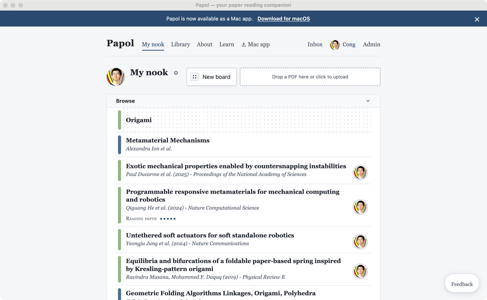
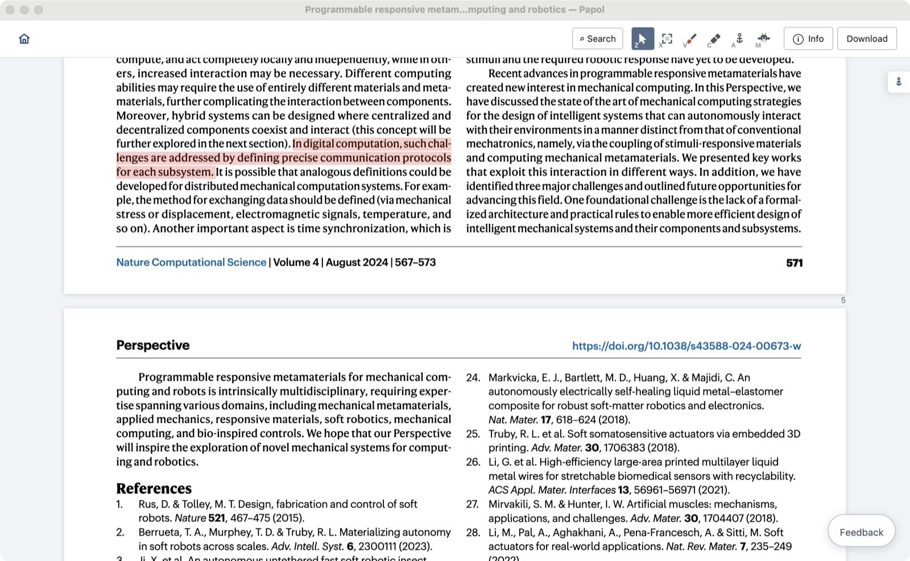
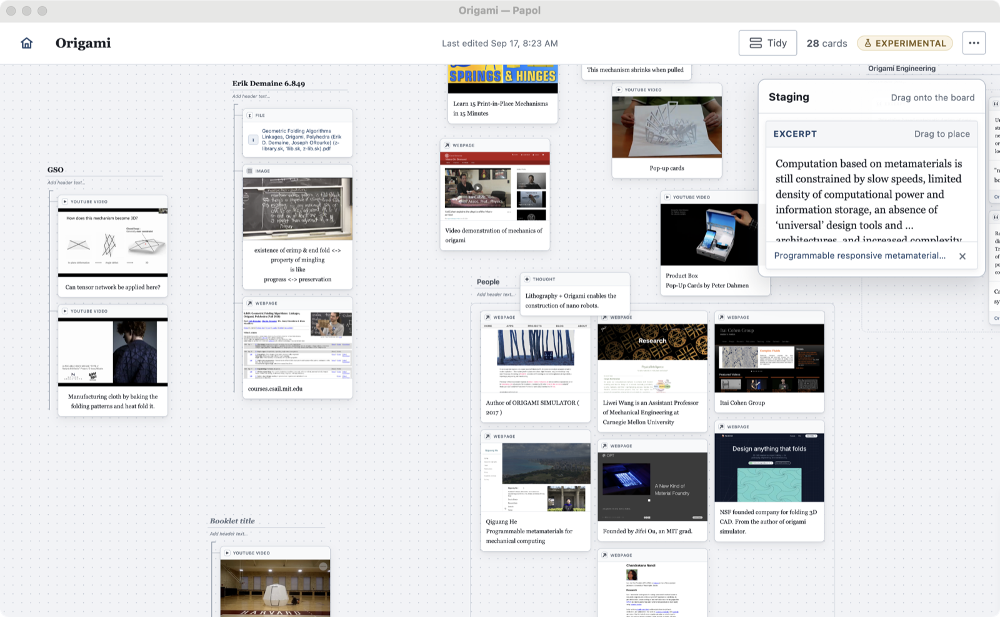
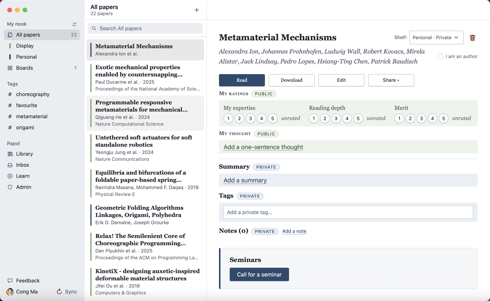

# Papol

Papol is your paper reading companion. It keeps you close to the papers, the
ideas, and the people that shape your thinking.

## Nook



## Viewer



## Board



## Papol for Mac



## Running it

Papol is a Cloudflare Worker (`cloudflare/`: the API and the jobs, on D1,
R2 and a Queue) serving three Vite apps (`frontend/`, `viewer/`, `board/`)
as its static assets, with a native macOS shell (`desktop/`) around the same
pages. Every tool comes from `flake.nix`: `direnv allow`, or `nix develop`.

```sh
./deploy.sh dev                       # the Worker on :8787, the apps live-reloading on :5173
```

Or the Worker alone:

```sh
cd cloudflare && npm ci --legacy-peer-deps && npx wrangler dev
```

Its suite is `npm test` there, in the Workers runtime against a local
database; each app's is `npm test` in its directory. Main deploys
itself to dev.papol.io; `./deploy.sh prod` runs the same workflow for
https://papol.io, and `deploy.sh`'s header lists the rest. How
the system came to be shaped this way is in `docs/cloud-migration.md`.
