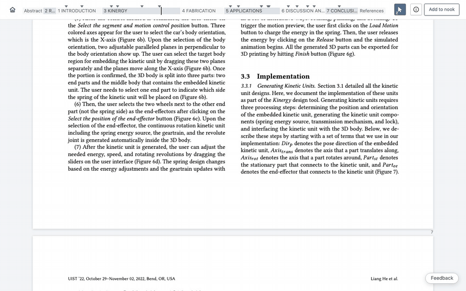
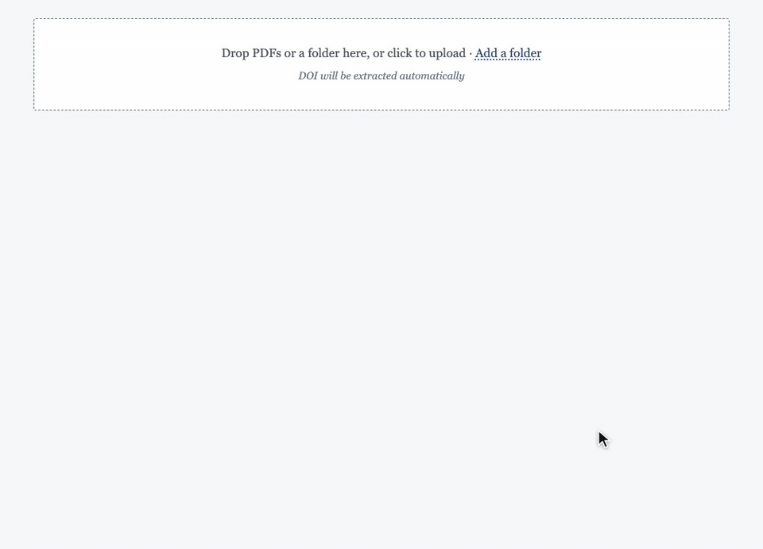
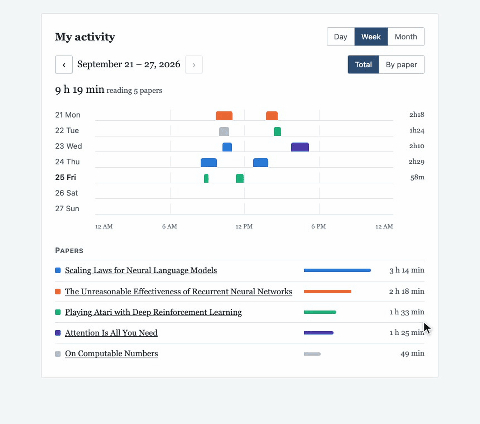

# What's new in Papol

*September 25, 2026*

Hello,

This week Papol moved to Cloudflare's global cloud, and it now has its own
domain, papol.io. Your data and your visits to Papol are now backed by
Cloudflare's security and reliability, and you should notice Papol responding
faster. Here are this week's new features, the most useful first.

## 1. Intelligent link navigation

In an ordinary PDF reader, clicking "Figure 7" takes you to its page, and you
scroll and zoom to find the figure. In Papol, the figure appears centred and
zoomed to fill your window, even in a two-column paper. A section link opens
at its heading, in its column, at a size you can read, and tables, footnotes
and algorithms open the same way. To return to where you were reading, click
the **Back to page** button at the bottom or press `[`.

## 2. Reverse citation

To see how a paper uses one source, you normally search for "[47]" and hope
you catch every mention. In Papol, click **[47]** and a card tells you
"Cited 7 times in this paper"; ↑ and ↓ take you to each place while the card
stays put. Press Esc or click away to stay where you are, or press `[` to
return to where you started.

![Clicking [47] opens its card, "Cited 7 times in this paper"; the arrows step through each place, from page 3 to page 8](img/reverse-citation.gif)

## 3. Folder Drop

When an AI agent gathers papers for a literature review, you still upload
its PDFs one at a time and lose why it picked each one. Click **Add a
folder**, give your agent the one-line prompt Papol shows you, and drop the
folder it fills onto any upload box. The papers appear in the agent's order,
each with its reason saved as a private note on your copy; papers you
already have are skipped, and ones it couldn't get are listed for you to
find. Choose a shelf and tags, and the whole review is in your library.

## 4. Tiny links

A share link now fits in any message: `papol.io/s/KedS24Oq7W`. The person
you send it to sees your annotations, labelled as yours.

## 5. Papol on your Mac

The Papol Mac app is released, and the latest version is 0.5.6. It works
offline, so you can read your papers without an internet connection. Get it
from **Mac app** at the top of papol.io.

## 6. Reading log

See how much of your week went to reading. **My activity** on your profile
shows your reading time by day, week or month, and for each paper. Only you
can see it.

---

Something not right? The **Feedback** button on every page reaches us
directly.

The Papol team
