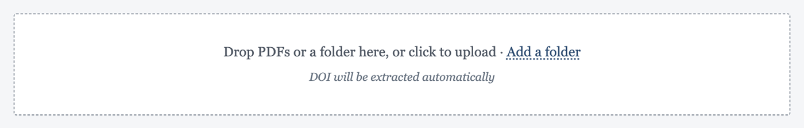
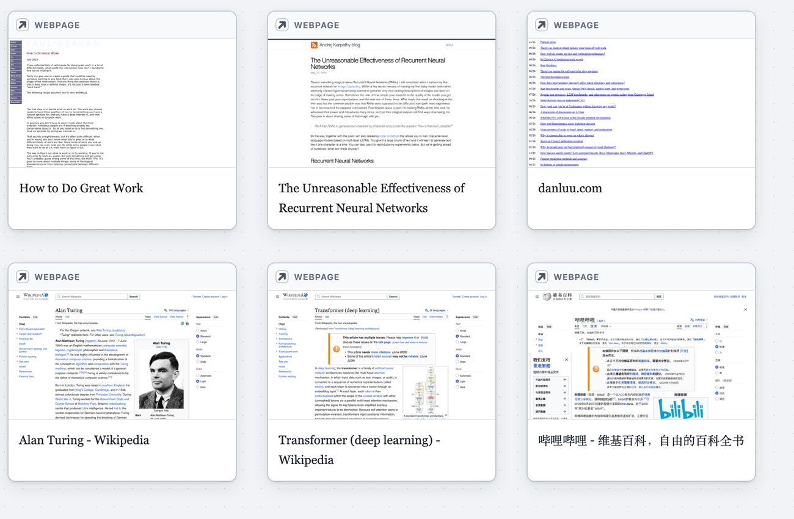

# What's new in Papol

*September 25, 2026 · covers everything since Papol moved to papol.io on September 21*

Hello,

It's been a busy week for Papol. Here is what changed and how to try it.
If you share papers with links, please read the last section: old links
have stopped working.

## Add a whole folder of papers at once

Every upload box, in the Library, in your nook and in the Mac app, now takes
several PDFs at once, or a whole folder. Drop them in or click **Add a folder**.

Before anything is saved, you see one review of the batch. Papol reads each
PDF while you look. It tells you which papers are new, which are already in
your nook (those are skipped and never uploaded again), and which are
missing. Untick what you don't want, fix a title, and pick the shelf and
tags for the whole batch.

If an AI agent gathered the papers for you, **Add a folder** shows a
one-line prompt to give it. The agent then puts a short `papol.json` list
beside the PDFs, and your notes on each paper come in with it.

## Citations: see every place a paper cites a work

Click a citation such as **[18]** and its card now says how often the paper
cites that work, for example *Cited 4 times in this paper*. Use the ↑ ↓
buttons, or the arrow keys, to step through each place in reading order.
The card stays where it is while the pages move under it.

When you are done, press Esc or click away, and you stay where you ended
up. **Back to page 2** at the bottom of the window, or the `[` key, takes
you back to where you started.

Cards also read larger now. A reference that cites several works at once
looks them all up, and **Report a problem** on any card sends us what it
knew, already filled in.

## Links inside a paper land where they point

- **Figures and tables:** clicking "Figure 4" zooms until the figure fills
  the window.
- **Sections:** a link to "Section 3.2" opens that section's column from its
  heading, at a size you can read.
- **Footnotes:** a footnote mark takes you to its note.

Every jump leaves a **Back to page …** button, and `[` and `]` go back and
forth. The Navigator along the top now shows on every paper. The notices a
paper closes on (acknowledgements, competing interests and so on) sit in one
narrow **End** instead of stretching the last section. Selecting text also
behaves across links and at the short last line of a paragraph.

## My activity

Your profile has a new **My activity** panel, right under Account. It shows
the time you spent reading, by day, week or month, and which papers the
time went to. Only you can see it.

## Boards

Link cards now come onto a board at one size. A webpage card is named by the
page's title, not its address, and shows a picture of the page. YouTube
videos show their cover and title.

## Sharing: shorter links, and old links have stopped working

Share links are now short, like `papol.io/s/KedS24Oq7W`. A shared reading
says it is *Showing Alice's annotations*, so the person you sent it to knows
whose notes they see.

**A share link made before September 25 no longer works.**
They will see that the paper is no longer shared. To share it again, open
the paper, choose **Share**, and send the new link.

## Papol for Mac

Papol for Mac is at version 0.5.5. If yours is too old to talk to papol.io,
it will ask you to update, and **Mac app** at the top of papol.io has the
latest. On the Mac, the viewer's info window opens a paper in the app,
papers you add land on your default shelf, and link cards get their
pictures.

---

Exporting your nook (on your profile page) now gives you one file that holds
every PDF exactly as you added it, however large your nook is.

If something looks wrong, the **Feedback** button at the bottom right of every
page comes straight to us.

Happy reading,
The Papol team
