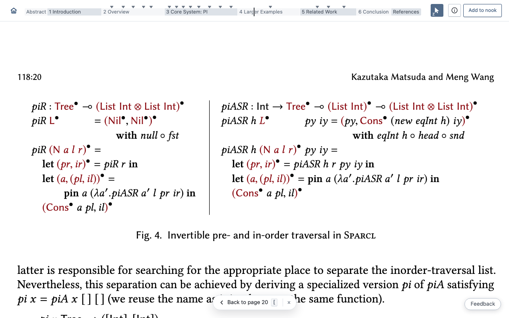
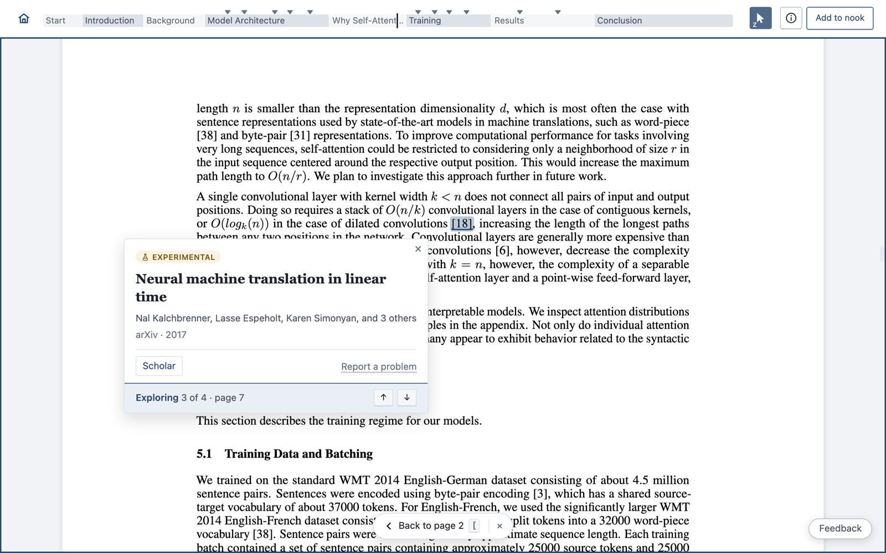
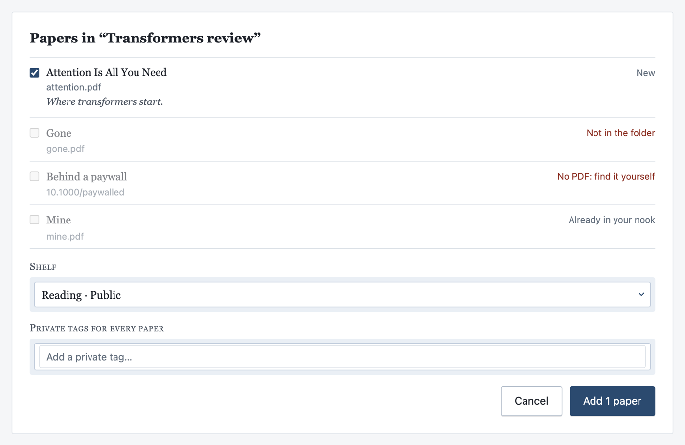
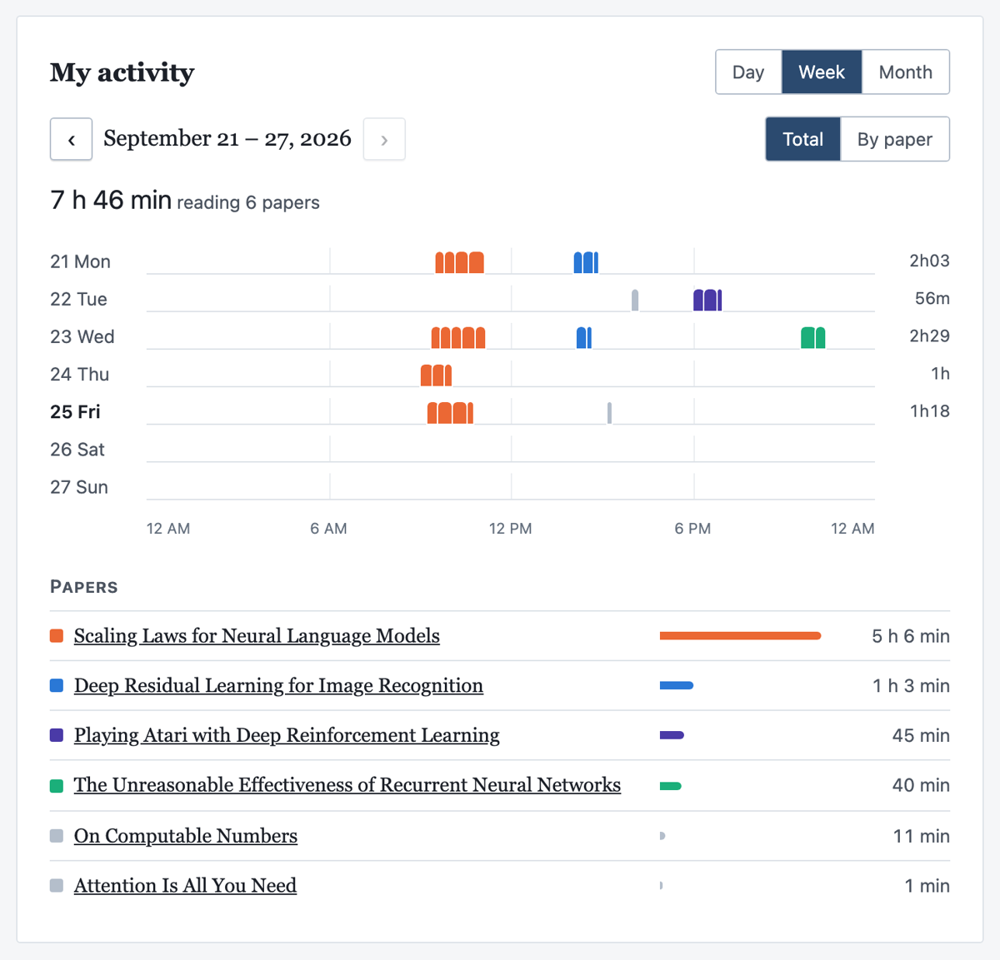

# What's new in Papol

*September 25, 2026*

Hello,

Six new things in Papol, most useful first.

## 1. Intelligent link navigation

Click "Figure 4" and the figure fills your window. A link to "Section 3.2"
opens at its heading, at a size you can read. A footnote mark takes you to
its note. Every jump leaves **Back to page …** (or press `[`), so you never
lose your place.

## 2. Reverse citation

Click a citation such as **[18]** to see every place the paper cites that
work: *Cited 4 times in this paper*. Step through them with ↑ ↓. You see how
the authors use a source without searching for it, and `[` brings you back.

## 3. Folder Drop

Drop a folder of PDFs, or several at once, on any upload box. Papol reads
them all and shows one list. Papers already in your nook are skipped. Choose
a shelf and tags for the whole batch, and your reading list is in.

If an AI agent gathered the papers, **Add a folder** gives you a prompt for
it, and its notes on each paper come in too.

## 4. Tiny links

Share links are now short, like `papol.io/s/KedS24Oq7W`. The person you send
one to sees your annotations, and they are labelled as yours.

**Links made before September 25 no longer work.** To share a paper again,
open it, choose **Share**, and send the new link.

## 5. Papol on your Mac

Papol for Mac 0.5.5 keeps your papers with you. Papers you add go straight
to your default shelf, and any paper opens in the app from its info window.
An older app will ask you to update. Get it from **Mac app** at the top of
papol.io.

## 6. Reading log

**My activity** on your profile shows how long you read, by day, week or
month, and on which papers. Only you can see it.

---

Something not right? The **Feedback** button on every page comes straight to us.

Happy reading,
The Papol team
